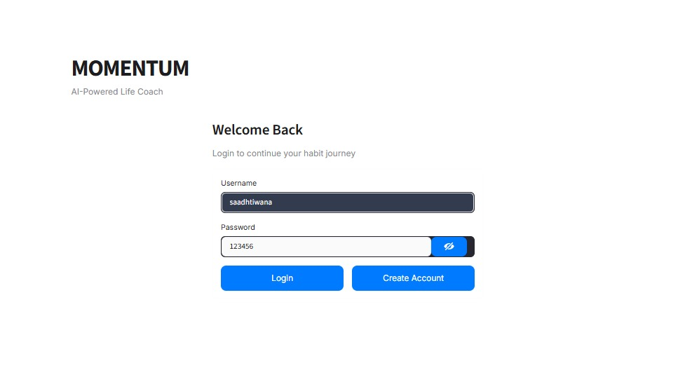
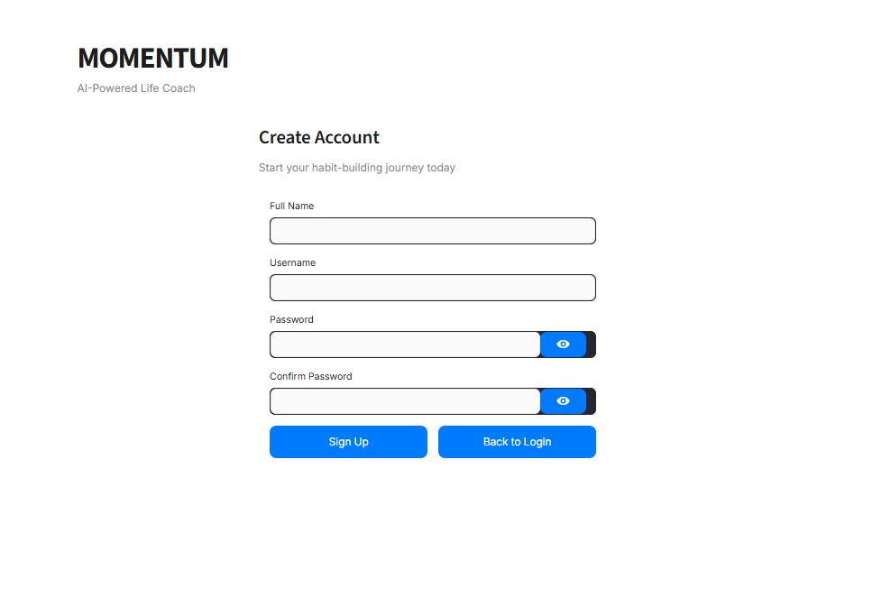
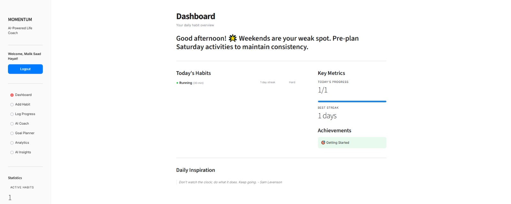
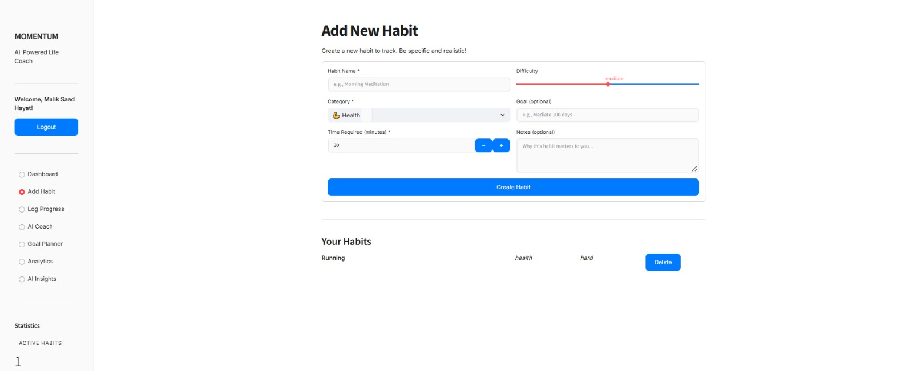
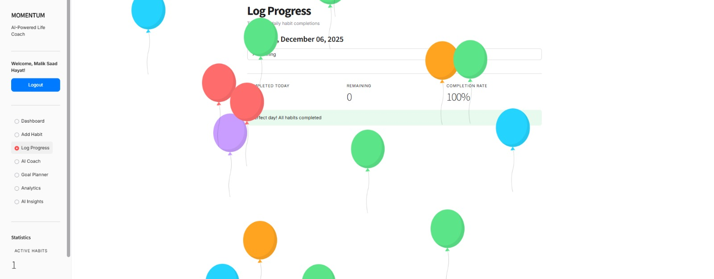
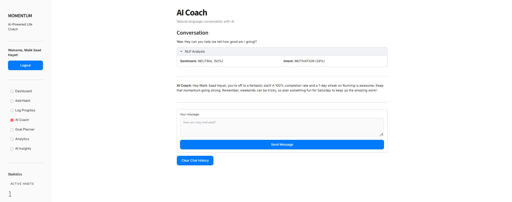
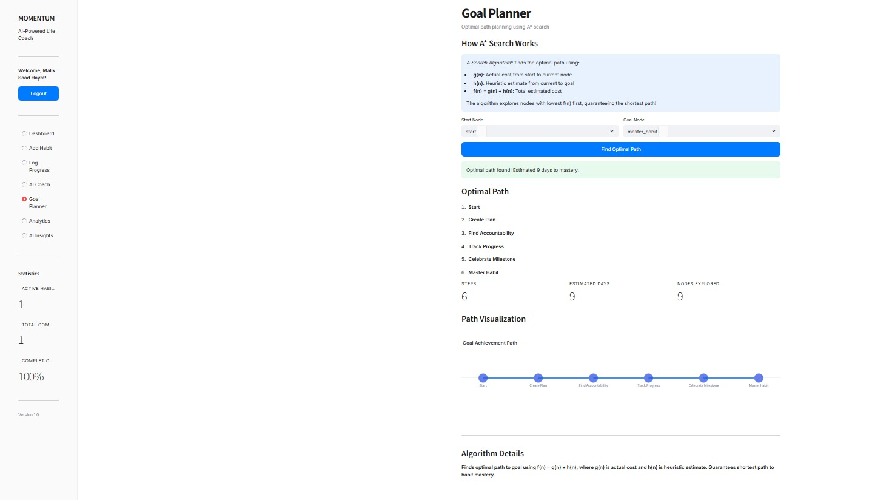
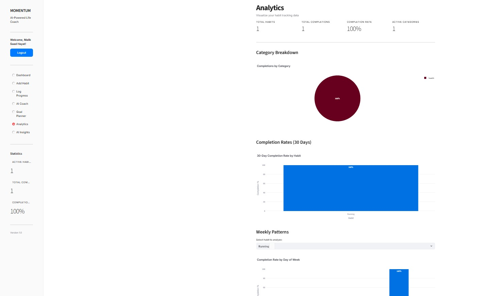
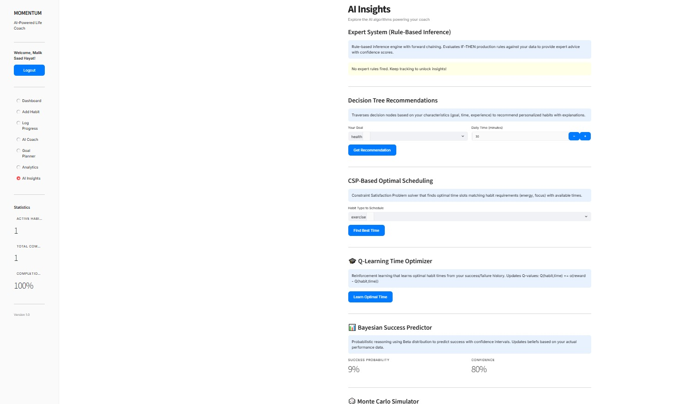

<div align="center">

# MOMENTUM

### AI-Powered Habit & Life Coach

*Transform your potential into progress with 12 advanced AI algorithms*

[](https://github.com/saadhtiwana/Momentum)
[](https://www.python.org/)
[](https://streamlit.io/)
[](https://github.com/saadhtiwana/Momentum)

---

## 🎯 The Ultimate Habit Building Experience

MOMENTUM isn't just another habit tracker—it's a **psychology-driven, AI-powered transformation system** that combines cutting-edge artificial intelligence with proven behavioral science to help you build lasting habits and achieve your goals.

</div>

---

## 📸 Preview

<div align="center">

### Dashboard & Analytics


### AI Coach & Insights


### Goal Planning & Tracking


### Advanced Analytics


### AI Algorithm Demonstrations


### Habit Management


### Progress Visualization


### Achievement System


### Personalized Recommendations


</div>

---

## ⚡ Key Features

### 🤖 **12 Advanced AI Algorithms**
Harness the power of classical and modern AI techniques:

**Classical AI:**
- **A\* Search** - Optimal path planning to goal achievement
- **Expert System** - Rule-based coaching with confidence scores
- **NLP Engine** - Sentiment analysis and intent classification
- **Decision Tree** - Personalized habit recommendations
- **CSP Solver** - Constraint-based optimal scheduling
- **Best-First Search** - Habit prioritization by success probability

**Advanced AI:**
- **Q-Learning** - Reinforcement learning for time optimization
- **Bayesian Inference** - Probabilistic success prediction
- **Monte Carlo Simulation** - Goal achievement forecasting
- **Genetic Algorithm** - Schedule evolution
- **Simulated Annealing** - Optimal habit ordering
- **Minimax** - Game-theoretic strategic selection

### 🎮 **Gamification System**
Psychology-based engagement mechanics designed for maximum motivation:

- **Streak Tracking** - Visual streak counters with loss aversion triggers
- **Variable Rewards** - Random bonus points (30% chance + 2% jackpot)
- **Achievement System** - 11 unlockable achievements across 4 tiers (Bronze → Diamond)
- **Daily Bonuses** - Escalating login rewards
- **Leaderboards** - Simulated competition with realistic rankings
- **Progress Rings** - Satisfying visual completion indicators

### 🧠 **Gemini AI Integration**
Hyper-personalized coaching that knows you:

- Uses your actual name in every interaction
- Accesses complete habit history and analytics
- Provides data-driven, contextual advice
- Adaptive difficulty and encouragement
- Emotional intelligence and relationship building

### 📊 **Comprehensive Analytics**
Data-driven insights for continuous improvement:

- Real-time completion rates (7-day, 30-day)
- Streak tracking (current & maximum)
- Weekly pattern analysis
- Category performance breakdowns
- Success probability forecasting
- Detailed habit statistics

### 🔒 **Multi-User Authentication**
Secure, personalized experience:

- SHA-256 password hashing
- Per-user data isolation
- Session management
- Easy signup/login flow

### 🎨 **Ultra-Minimal Design**
Apple-inspired aesthetic:

- Clean, distraction-free interface
- Smooth animations and transitions
- Professional typography
- Intuitive navigation
- Responsive layout

---

## 🚀 Getting Started

### Prerequisites

- Python 3.8 or higher
- pip (Python package manager)
- Gemini API key (optional, for AI chat)

### Installation

1. **Clone the repository**
   ```bash
   git clone https://github.com/saadhtiwana/Momentum.git
   cd Momentum
   ```

2. **Install dependencies**
   ```bash
   pip install -r requirements.txt
   ```

3. **Set up Gemini AI** (Optional)
   
   Create `.streamlit/secrets.toml`:
   ```toml
   GEMINI_API_KEY = "your-api-key-here"
   ```
   
   Get your API key from [Google AI Studio](https://makersuite.google.com/app/apikey)

4. **Run the application**
   ```bash
   streamlit run app.py
   ```

5. **Access the app**
   
   Open your browser and navigate to `http://localhost:8501`

---

## 📖 Usage Guide

### First Time Setup

1. **Create Account**
   - Click "Sign Up"
   - Enter your full name, username, and password
   - Your data is stored securely with per-user isolation

2. **Add Your First Habit**
   - Navigate to "Add Habit"
   - Choose category, difficulty, and time commitment
   - Set your personal goal

3. **Track Daily Progress**
   - Go to "Log Progress"
   - Check off completed habits
   - Earn points and maintain streaks

4. **Explore AI Features**
   - **AI Coach** - Chat with Gemini for personalized advice
   - **Goal Planner** - Use A\* search for optimal achievement paths
   - **AI Insights** - Explore all 12 algorithms in action
   - **Analytics** - View detailed performance statistics

---

## 🧬 Technical Architecture

### Project Structure

```
Momentum/
├── app.py                 # Main Streamlit application
├── ai_algorithms.py       # 6 classical AI algorithms
├── advanced_ai.py         # 6 advanced AI algorithms
├── ai_coach.py           # AI coaching orchestration
├── habit_engine.py       # Core habit tracking logic
├── gamification.py       # Engagement & reward system
├── auth.py              # Authentication system
├── storage.py           # Data persistence
├── config.py            # Configuration & constants
├── requirements.txt     # Python dependencies
└── public/              # Screenshots & assets
```

### Technology Stack

- **Frontend**: Streamlit (Python web framework)
- **AI/ML**: Custom implementations (no ML libraries)
- **Authentication**: SHA-256 hashing
- **Data Storage**: JSON-based persistent storage
- **AI Integration**: Google Gemini API

### AI Algorithms Explained

Each algorithm serves a specific purpose:

| Algorithm | Purpose | Impact |
|-----------|---------|--------|
| A\* Search | Find shortest path to goals | Optimal achievement planning |
| Expert System | Apply habit-building rules | Evidence-based advice |
| NLP Engine | Understand user messages | Natural conversation |
| Decision Tree | Recommend habits | Personalized suggestions |
| CSP Solver | Schedule habits optimally | Time-energy matching |
| Q-Learning | Learn best times | Adaptive scheduling |
| Bayesian | Predict with confidence | Statistical forecasting |
| Monte Carlo | Simulate outcomes | Risk assessment |
| Genetic | Evolve schedules | Global optimization |
| Simulated Annealing | Refine ordering | Local optimization |
| Minimax | Strategic selection | Game-theoretic choices |
| Best-First Search | Prioritize habits | Success maximization |

---

## 🎓 Educational Value

This project demonstrates:

- **Classical AI Techniques** - Search algorithms, knowledge representation
- **Modern AI Paradigms** - Reinforcement learning, probabilistic reasoning
- **Software Engineering** - Clean architecture, modular design
- **UX Psychology** - Gamification, behavioral triggers
- **Data Science** - Analytics, pattern recognition
- **Full-Stack Development** - Complete application lifecycle

---

## 🌟 Key Highlights

✨ **12 AI Algorithms** - From A\* to Minimax, all implemented from scratch  
🎮 **Gamification** - Psychology-driven engagement for habit formation  
🤖 **Gemini Integration** - Natural language coaching with full context  
📊 **Rich Analytics** - Comprehensive insights into your progress  
🔒 **Secure & Private** - Per-user authentication and data isolation  
🎨 **Beautiful UI** - Apple-inspired minimalist design  
⚡ **Instant Feedback** - Real-time updates and visual celebrations  
📈 **Data-Driven** - Every recommendation backed by your actual stats  

---

## 🤝 Contributing

Contributions are welcome! Feel free to:

- Report bugs
- Suggest new features
- Improve documentation
- Add new AI algorithms
- Enhance UI/UX

---

## 📝 License

This project is open source and available for educational purposes.

---

## 🙏 Acknowledgments

- Built with [Streamlit](https://streamlit.io/)
- Powered by [Google Gemini](https://ai.google.dev/)
- Inspired by behavioral psychology and habit formation research
- Gamification mechanics from proven apps (Duolingo, Habitica)

---

## 📧 Contact

**Saad H. Tiwana**

- GitHub: [@saadhtiwana](https://github.com/saadhtiwana)
- Project Link: [https://github.com/saadhtiwana/Momentum](https://github.com/saadhtiwana/Momentum)

---

<div align="center">

### ⭐ Star this repo if MOMENTUM helped you build better habits!

**Made with ❤️ and lots of AI**

</div>
